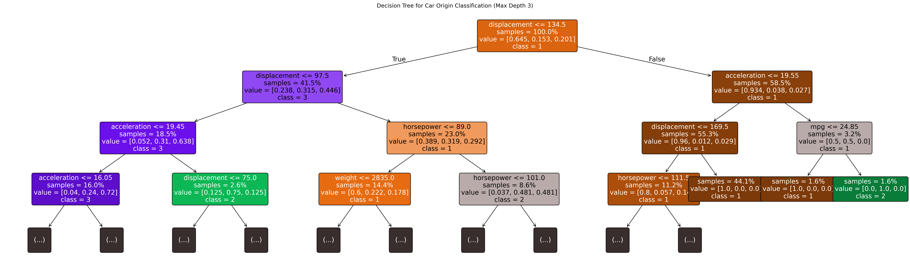
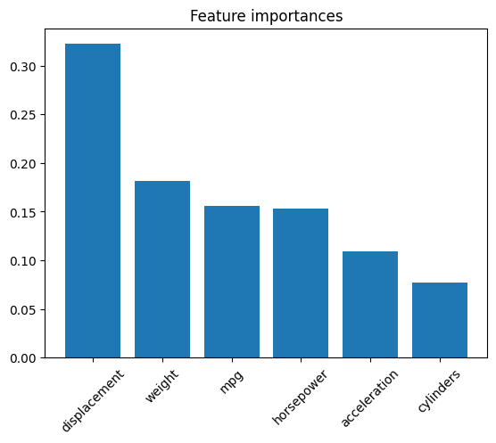

```python
# 2026-03-23: first mandatory cmlykke kladde
# We have a regression problem and a classification problem.
# this project is focues on the classification problem.

# Classification problem:

#We assume that cars from different regions will have different
# characteristics, therefore we want to ask the question:

#Can we predict the origin of a car based on its the
# following attributes: acceleration, weight, horsepower,
# displacement, cylinders, MPG.

```


```python
import pandas as pd
import numpy as np
import matplotlib.pyplot as plt
import seaborn as sns
from sklearn.model_selection import train_test_split, GridSearchCV, cross_val_score
from sklearn.tree import DecisionTreeClassifier, plot_tree
from sklearn.ensemble import RandomForestClassifier
from sklearn.metrics import classification_report, confusion_matrix, accuracy_score, f1_score

```


```python
# Load data
df = pd.read_csv('../../../data/cars.csv')
df.head()
#print(df.count())

```


<div>
<style scoped>
    .dataframe tbody tr th:only-of-type {
        vertical-align: middle;
    }

    .dataframe tbody tr th {
        vertical-align: top;
    }

    .dataframe thead th {
        text-align: right;
    }
</style>
<table border="1" class="dataframe">
  <thead>
    <tr style="text-align: right;">
      <th></th>
      <th>mpg</th>
      <th>cylinders</th>
      <th>displacement</th>
      <th>horsepower</th>
      <th>weight</th>
      <th>acceleration</th>
      <th>model year</th>
      <th>origin</th>
      <th>car name</th>
    </tr>
  </thead>
  <tbody>
    <tr>
      <th>0</th>
      <td>18.0</td>
      <td>8</td>
      <td>307.0</td>
      <td>130</td>
      <td>3504</td>
      <td>12.0</td>
      <td>70</td>
      <td>1</td>
      <td>chevrolet chevelle malibu</td>
    </tr>
    <tr>
      <th>1</th>
      <td>15.0</td>
      <td>8</td>
      <td>350.0</td>
      <td>165</td>
      <td>3693</td>
      <td>11.5</td>
      <td>70</td>
      <td>1</td>
      <td>buick skylark 320</td>
    </tr>
    <tr>
      <th>2</th>
      <td>18.0</td>
      <td>8</td>
      <td>318.0</td>
      <td>150</td>
      <td>3436</td>
      <td>11.0</td>
      <td>70</td>
      <td>1</td>
      <td>plymouth satellite</td>
    </tr>
    <tr>
      <th>3</th>
      <td>16.0</td>
      <td>8</td>
      <td>304.0</td>
      <td>150</td>
      <td>3433</td>
      <td>12.0</td>
      <td>70</td>
      <td>1</td>
      <td>amc rebel sst</td>
    </tr>
    <tr>
      <th>4</th>
      <td>17.0</td>
      <td>8</td>
      <td>302.0</td>
      <td>140</td>
      <td>3449</td>
      <td>10.5</td>
      <td>70</td>
      <td>1</td>
      <td>ford torino</td>
    </tr>
  </tbody>
</table>
</div>


```python
# Data exploration and cleaning
# Check for missing values
#print(df.isnull().sum())

# Horsepower has '?' as missing values
df['horsepower'] = pd.to_numeric(df['horsepower'], errors='coerce')
df = df.dropna(subset=['horsepower'])
print(df.count())

```

    mpg             392
    cylinders       392
    displacement    392
    horsepower      392
    weight          392
    acceleration    392
    model year      392
    origin          392
    car name        392
    dtype: int64
    


```python
# Define features and target
features = ['acceleration', 'weight', 'horsepower', 'displacement', 'cylinders', 'mpg']
X = df[features]
y = df['origin']

# Split data
X_train, X_test, y_train, y_test = train_test_split(X, y, test_size=0.2, random_state=42)

```


```python
# take a look at the split data:
print(X_train.count())
print(X_test.count())
print(y_train.count())
print(y_test.count())
```

    acceleration    313
    weight          313
    horsepower      313
    displacement    313
    cylinders       313
    mpg             313
    dtype: int64
    acceleration    79
    weight          79
    horsepower      79
    displacement    79
    cylinders       79
    mpg             79
    dtype: int64
    313
    79
    


```python
# Single Decision Tree
# Using max_depth=5 to prevent overfitting and make it more manageable for a paper.
dt_model = DecisionTreeClassifier(max_depth=5, random_state=42)
dt_model.fit(X_train, y_train)

# Predictions
y_pred_dt = dt_model.predict(X_test)

# Evaluation
print("Decision Tree Accuracy:", accuracy_score(y_test, y_pred_dt))
print("\nClassification Report:\n", classification_report(y_test, y_pred_dt))


```

    Decision Tree Accuracy: 0.7974683544303798
    
    Classification Report:
                   precision    recall  f1-score   support
    
               1       0.82      0.95      0.88        43
               2       0.74      0.70      0.72        20
               3       0.80      0.50      0.62        16
    
        accuracy                           0.80        79
       macro avg       0.79      0.72      0.74        79
    weighted avg       0.79      0.80      0.79        79
    
    


```python

# %%
# Visualize Decision Tree
# To keep the tree readable for a paper, we limit the depth
plt.figure(figsize=(35, 10), dpi=300) # Increased figure size more to reduce overlap at 3rd level nodes
annotations = plot_tree(dt_model,
          feature_names=features,
          class_names=[str(c) for c in dt_model.classes_],
          filled=True,
          rounded=True,
          fontsize=14, # Slightly larger font for better readability with larger figure size
          impurity=False, # Removed impurity to reduce clutter and make text more readable
          proportion=True, # Show proportions to make numbers smaller and cleaner
          max_depth=3) # Limit depth for visualization

# Darken the background of nodes to improve text readability
import colorsys
for ann in annotations:
    bbox_patch = ann.get_bbox_patch()
    if bbox_patch is not None:
        fc = bbox_patch.get_facecolor()
        r, g, b, a = fc
        h, l, s = colorsys.rgb_to_hls(r, g, b)
        # Darken the lightness (l) by a significant amount (e.g., 30%)
        # and increase saturation (s) to keep it colorful
        new_l = max(0, l - 0.3)
        new_s = min(1, s + 0.1)
        new_r, new_g, new_b = colorsys.hls_to_rgb(h, new_l, new_s)
        bbox_patch.set_facecolor((new_r, new_g, new_b, a))
        
        # Adjust text color for contrast
        if new_l < 0.5:
            ann.set_color('white')
        else:
            ann.set_color('black')

plt.title("Decision Tree for Car Origin Classification (Max Depth 3)")
plt.show()
```


    

    


```python


# %%
# Random Forest
rf_model = RandomForestClassifier(n_estimators=100, random_state=42)
rf_model.fit(X_train, y_train)

# Predictions
y_pred_rf = rf_model.predict(X_test)

# Evaluation
print("Random Forest Accuracy:", accuracy_score(y_test, y_pred_rf))
print("\nClassification Report:\n", classification_report(y_test, y_pred_rf))
```

    Random Forest Accuracy: 0.759493670886076
    
    Classification Report:
                   precision    recall  f1-score   support
    
               1       0.83      0.91      0.87        43
               2       0.62      0.65      0.63        20
               3       0.73      0.50      0.59        16
    
        accuracy                           0.76        79
       macro avg       0.73      0.69      0.70        79
    weighted avg       0.76      0.76      0.75        79
    
    


```python
# Feature Importance
importances = rf_model.feature_importances_
indices = np.argsort(importances)[::-1]

plt.figure()
plt.title("Feature importances")
plt.bar(range(X.shape[1]), importances[indices], align="center")
plt.xticks(range(X.shape[1]), [features[i] for i in indices], rotation=45)
plt.show()

```


    

    


```python
# feature importance asa a table:
# Create a DataFrame with features and their importance scores
importance_table = pd.DataFrame({
    'Feature': features,
    'Importance': rf_model.feature_importances_
})

# Sort by importance (descending)
importance_table = importance_table.sort_values(by='Importance', ascending=False)

print(importance_table)
```

            Feature  Importance
    3  displacement    0.322400
    1        weight    0.181861
    5           mpg    0.156178
    2    horsepower    0.153274
    0  acceleration    0.108909
    4     cylinders    0.077378
    


```python
# %%
# Strategy for Fine-tuning Decision Trees and Random Forests
# Given the small dataset (~400 rows) and class imbalance (Origin 1 is majority),
# the best practice strategy is to:
# 1. Use GridSearchCV for systematic hyperparameter exploration.
# 2. Use cross-validation to ensure the model generalizes well across small subsets.
# 3. Use 'class_weight' to handle the imbalance between regions.
# 4. Focus on 'f1-score' or 'balanced_accuracy' rather than just 'accuracy'.
```


```python
# %%
# 1. Decision Tree Fine-tuning
# Define the parameter grid
dt_param_grid = {
    'max_depth': [3, 4, 5, 6, 8, 10],
    'min_samples_split': [2, 5, 10],
    'min_samples_leaf': [1, 2, 4],
    'criterion': ['gini', 'entropy'],
    'class_weight': [None, 'balanced']
}

# Run Grid Search
dt_grid = GridSearchCV(DecisionTreeClassifier(random_state=42), dt_param_grid, cv=5, scoring='f1_weighted')
dt_grid.fit(X_train, y_train)

print("Best Decision Tree Parameters:", dt_grid.best_params_)
print("Best Cross-validated F1-score:", dt_grid.best_score_)


```

    Best Decision Tree Parameters: {'class_weight': None, 'criterion': 'entropy', 'max_depth': 10, 'min_samples_leaf': 2, 'min_samples_split': 10}
    Best Cross-validated F1-score: 0.8472485425572314
    


```python

# Best Model Performance on Test Set
best_dt_model = dt_grid.best_estimator_
y_pred_best_dt = best_dt_model.predict(X_test)
print("\nFine-tuned Decision Tree Report:\n", classification_report(y_test, y_pred_best_dt))
```

    
    Fine-tuned Decision Tree Report:
                   precision    recall  f1-score   support
    
               1       0.83      0.91      0.87        43
               2       0.55      0.60      0.57        20
               3       0.70      0.44      0.54        16
    
        accuracy                           0.73        79
       macro avg       0.69      0.65      0.66        79
    weighted avg       0.73      0.73      0.73        79
    
    


```python

# %%
# 2. Random Forest Fine-tuning
# Define the parameter grid
rf_param_grid = {
    'n_estimators': [50, 100, 200],
    'max_depth': [5, 8, 12, None],
    'min_samples_split': [2, 5, 10],
    'max_features': ['sqrt', 'log2', None],
    'class_weight': ['balanced', 'balanced_subsample', None]
}

# Run Grid Search
rf_grid = GridSearchCV(RandomForestClassifier(random_state=42), rf_param_grid, cv=5, scoring='f1_weighted')
rf_grid.fit(X_train, y_train)

print("Best Random Forest Parameters:", rf_grid.best_params_)
print("Best Cross-validated F1-score:", rf_grid.best_score_)
```

    Best Random Forest Parameters: {'class_weight': None, 'max_depth': 8, 'max_features': None, 'min_samples_split': 2, 'n_estimators': 200}
    Best Cross-validated F1-score: 0.8688954188602027
    


```python

# Best Model Performance on Test Set
best_rf_model = rf_grid.best_estimator_
y_pred_best_rf = best_rf_model.predict(X_test)
print("\nFine-tuned Random Forest Report:\n", classification_report(y_test, y_pred_best_rf))

```

    
    Fine-tuned Random Forest Report:
                   precision    recall  f1-score   support
    
               1       0.87      0.93      0.90        43
               2       0.71      0.75      0.73        20
               3       0.83      0.62      0.71        16
    
        accuracy                           0.82        79
       macro avg       0.81      0.77      0.78        79
    weighted avg       0.82      0.82      0.82        79
    
    


```python

# %%
# 3. Model Comparison
# Print comparison of original and fine-tuned results
print(f"Original DT Accuracy: {accuracy_score(y_test, y_pred_dt):.4f}")
print(f"Fine-tuned DT Accuracy: {accuracy_score(y_test, y_pred_best_dt):.4f}")
print(f"Original RF Accuracy: {accuracy_score(y_test, y_pred_rf):.4f}")
print(f"Fine-tuned RF Accuracy: {accuracy_score(y_test, y_pred_best_rf):.4f}")

# %%

```

    Original DT Accuracy: 0.7975
    Fine-tuned DT Accuracy: 0.7342
    Original RF Accuracy: 0.7595
    Fine-tuned RF Accuracy: 0.8228
    


```python

```
